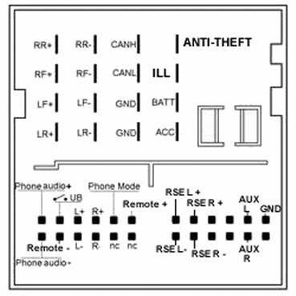

# Reverse engineering CANbus messages of Fiesta MK5 dashboard/radio subsystem
This documentation applies to Ford Fiesta MK5 >2006 (MK5 restyling), with 2-DIN, 6000CD radio.

The radio sends messages to the LCD screen in the dashboard, like FM station names, CD track IDs, volume changes.

The idea was to tap into the text-to-LCD mechanism, but I ended up reversing some other interesting CANbus messages.

Tapping in the infotaiment CANbus is quite easy: just connect a CANbus interface over CANH and CANL lines that come into the QuadLock conector of the radio, no 120 Ohm terminal block resistor needed.



Personally, I used a [SeedStudio CANbus Shield](https://wiki.seeedstudio.com/CAN-BUS_Shield_V2.0/) stacked onto an Arduino Uno R3. 

## Results
Bus speed is 125 KBPS.

The IDs of either partially or fully decoded messages are:
- 0x080
- 0x1e9
- 0x201
- 0x265
- 0x285
- 0x286
- 0x2d5
- 0x2d8
- 0x2da
- 0x2db
- 0x360
- 0x420
- 0x428
- 0x433
- 0x460
- 0x4c0
- 0x4f3

### Text to LCD screen
The radio sends text to the dashboard LCD using either a short message format or an extended message format. 

The short format can only be seen whenever the radio switches to AUX mode.

<table class="tg">
<thead>
  <tr>
    <th class="tg-c3ow">ID</th>
    <th class="tg-c3ow">1</th>
    <th class="tg-c3ow">2</th>
    <th class="tg-c3ow">3</th>
    <th class="tg-c3ow">4</th>
    <th class="tg-c3ow">5</th>
    <th class="tg-c3ow">6</th>
    <th class="tg-c3ow">7</th>
    <th class="tg-c3ow">8</th>
  </tr>
</thead>
<tbody>
  <tr>
    <td class="tg-c3ow">0x4C0</td>
    <td class="tg-c3ow">0x7</td>
    <td class="tg-c3ow">0x34</td>
    <td class="tg-c3ow" colspan="6">ASCII text</td>
  </tr>
</tbody>
</table>

The extended format is composed by one header message containing the length of the text, and subsequent messages that provide additional text portions.

<table class="tg">
<thead>
  <tr>
    <th class="tg-c3ow">ID</th>
    <th class="tg-c3ow">1</th>
    <th class="tg-c3ow">2</th>
    <th class="tg-c3ow">3</th>
    <th class="tg-c3ow">4</th>
    <th class="tg-c3ow">5</th>
    <th class="tg-c3ow">6</th>
    <th class="tg-c3ow">7</th>
    <th class="tg-c3ow">8</th>
  </tr>
</thead>
<tbody>
  <tr>
    <td class="tg-c3ow">0x4C0</td>
    <td class="tg-c3ow">0x10</td>
    <td class="tg-c3ow">Text length + 2</td>
    <td class="tg-c3ow">0x34</td>
    <td class="tg-c3ow" colspan="5">ASCII text</td>
  </tr>
  <tr>
    <td class="tg-0pky">0x4C0</td>
    <td class="tg-0pky">0x21</td>
    <td class="tg-0pky" colspan="7">ASCII text</td>
  </tr>
</tbody>
</table>

### Radio station name

The radio also shares the radio station name with a specific message.

<table class="tg">
<thead>
  <tr>
    <th class="tg-c3ow">ID</th>
    <th class="tg-c3ow">1</th>
    <th class="tg-c3ow">2</th>
    <th class="tg-c3ow">3</th>
    <th class="tg-c3ow">4</th>
    <th class="tg-c3ow">5</th>
    <th class="tg-c3ow">6</th>
    <th class="tg-c3ow">7</th>
    <th class="tg-c3ow">8</th>
  </tr>
</thead>
<tbody>
  <tr>
    <td class="tg-c3ow">0x1E9</td>
    <td class="tg-c3ow" colspan="8">ASCII text</td>
  </tr>
</tbody>
</table>

### Radio OFF
When the radio is OFF this message is broadcasted.
<table class="tg">
<thead>
  <tr>
    <th class="tg-c3ow">ID</th>
    <th class="tg-c3ow">1</th>
    <th class="tg-c3ow">2</th>
    <th class="tg-c3ow">3</th>
    <th class="tg-c3ow">4</th>
    <th class="tg-c3ow">5</th>
    <th class="tg-c3ow">6</th>
    <th class="tg-c3ow">7</th>
    <th class="tg-c3ow">8</th>
  </tr>
</thead>
<tbody>
  <tr>
    <td class="tg-c3ow">0x4C0</td>
    <td class="tg-c3ow">0x2</td>
    <td class="tg-c3ow">0x34</td>
    <td class="tg-c3ow" colspan="6">0</td>
  </tr>
</tbody>
</table>

### Radio mode / seek buttons
Apparently, only mode and seek buttons near the steering column issue commands over MS-CAN, while unfortunately it seems that volume buttons are not.

<table>
<thead>
  <tr>
    <th>ID</th>
    <th>1</th>
    <th>2</th>
    <th>3</th>
    <th>4</th>
    <th>5</th>
    <th>6</th>
    <th>7</th>
    <th>8</th>
  </tr>
</thead>
<tbody>
  <tr>
    <td>0x2D5</td>
    <td colspan="1">(unspecified)</td>
    <td>&lt;buttons&gt;</td>
    <td colspan="6">(unspecified)</td>
  </tr>
</tbody>
</table>

buttons is a bitmask: the byte is the algebraic sum of these condition codes, whenever applicable.

<table>
<thead>
  <tr>
    <th>Status</th>
    <th>Code</th>
  </tr>
</thead>
<tbody>
  <tr>
    <td>Mode button</td>
    <td>0x10</td>
  </tr>
  <tr>
    <td>Seek up</td>
    <td>0x40</td>
  </tr>
  <tr>
    <td>Seek down</td>
    <td>0x80</td>
  </tr>
</tbody>
</table>

### Radio volume

The radio unit broadcasts a message containing the current volume level.


<table class="tg">
<thead>
  <tr>
    <th class="tg-c3ow">ID</th>
    <th class="tg-c3ow">1</th>
    <th class="tg-c3ow">2</th>
    <th class="tg-c3ow">3</th>
  </tr>
</thead>
<tbody>
  <tr>
    <td class="tg-c3ow">0x2D8</td>
    <td class="tg-c3ow">0x00</td>
    <td class="tg-c3ow">&lt;volume_raw&gt;</td>
    <td class="tg-c3ow">0x00</td>
  </tr>
</tbody>
</table>

where the real volume level can be obtained as:

```
volume = volume_raw/8
```

### CD track info

When the unit is not in CD playback mode, the following message is emitted:

<table class="tg">
<thead>
  <tr>
    <th class="tg-c3ow">ID</th>
    <th class="tg-c3ow">1</th>
    <th class="tg-c3ow">2</th>
    <th class="tg-c3ow">3</th>
    <th class="tg-c3ow">4</th>
    <th class="tg-c3ow">5</th>
    <th class="tg-c3ow">6</th>
    <th class="tg-c3ow">7</th>
    <th class="tg-c3ow">8</th>
  </tr>
</thead>
<tbody>
  <tr>
    <td class="tg-c3ow">0x2DB</td>
    <td class="tg-c3ow">0xFF</td>
    <td class="tg-c3ow">0xFF</td>
    <td class="tg-c3ow">0xFF</td>
    <td class="tg-c3ow">0xFF</td>
    <td class="tg-c3ow">0x00</td>
    <td class="tg-c3ow">0x00</td>
    <td class="tg-c3ow">0x00</td>
    <td class="tg-c3ow">0x00</td>
  </tr>
</tbody>
</table>

Instead, during CD playback, the message contains the track id and current seek time:

<table class="tg">
<thead>
  <tr>
    <th class="tg-c3ow">ID</th>
    <th class="tg-c3ow">1</th>
    <th class="tg-c3ow">2</th>
    <th class="tg-c3ow">3</th>
    <th class="tg-c3ow">4</th>
    <th class="tg-c3ow">5</th>
    <th class="tg-c3ow">6</th>
    <th class="tg-c3ow">7</th>
    <th class="tg-c3ow">8</th>
  </tr>
</thead>
<tbody>
  <tr>
    <td class="tg-c3ow">0x2DB</td>
    <td class="tg-c3ow">0xFF</td>
    <td class="tg-c3ow">0xFF</td>
    <td class="tg-c3ow" colspan="2">&lt;track_time&gt;</td>
    <td class="tg-c3ow">0x00</td>
    <td class="tg-c3ow">&lt;track_id&gt;</td>
    <td class="tg-c3ow">0x00</td>
    <td class="tg-c3ow">0x00</td>
  </tr>
</tbody>
</table>

where the current track time, in seconds, can be obtained like this:
```
track_seconds = track_time - 64
```

### CD status

The radio unit tells informations about the CD presence.

<table>
<thead>
  <tr>
    <th>ID</th>
    <th>1</th>
    <th>2</th>
    <th>3</th>
    <th>4</th>
    <th>5</th>
</tr>
</thead>
<tbody>
  <tr>
    <td>0x2DA</td>
    <td>(unspecified)</td>
    <td>&lt;cd_mode&gt;</td>
    <td>0x00</td>
    <td>&lt;cd_drive&gt;</td> 
    <td>0x00</td> 
  </tr>
</tbody>
</table>

<table class="tg">
<thead>
  <tr>
    <th class="tg-c3ow">CD Mode</th>
    <th class="tg-c3ow">Code</th>
  </tr>
</thead>
<tbody>
  <tr>
    <td class="tg-c3ow">No CD inserted</td>
    <td class="tg-c3ow">0x2A</td>
  </tr>
  <tr>
    <td class="tg-c3ow">CD inserted - playback</td>
    <td class="tg-c3ow">0x4A</td>
  </tr>
  <tr>
    <td class="tg-c3ow">CD inserted - no playback</td>
    <td class="tg-c3ow">0x6A</td>
  </tr>
</tbody>
</table>

<table class="tg">
<thead>
  <tr>
    <th class="tg-c3ow">CD Drive</th>
    <th class="tg-c3ow">Code</th>
  </tr>
</thead>
<tbody>
  <tr>
    <td class="tg-c3ow">No CD inserted</td>
    <td class="tg-c3ow">0x23</td>
  </tr>
  <tr>
    <td class="tg-c3ow">CD loading</td>
    <td class="tg-c3ow">0x21</td>
  </tr>
  <tr>
    <td class="tg-c3ow">CD inserted - no playback</td>
    <td class="tg-c3ow">0x22</td>
  </tr>
  <tr>
    <td class="tg-c3ow">CD inserted - playback</td>
    <td class="tg-c3ow">0x26</td>
  </tr>
</tbody>
</table>


### Date & Time
The car has an onboard RTC that works independently from the radio clock (it works even if the radio is disconnected at all). The date and time are broadcasted with 1 second resolution.
<table class="tg">
<thead>
  <tr>
    <th class="tg-c3ow">ID</th>
    <th class="tg-c3ow">1</th>
    <th class="tg-c3ow">2</th>
    <th class="tg-c3ow">3</th>
    <th class="tg-c3ow">4</th>
    <th class="tg-c3ow">5</th>
    <th class="tg-c3ow">6</th>
  </tr>
</thead>
<tbody>
  <tr>
    <td class="tg-c3ow">0x80</td>
    <td class="tg-c3ow">year (two digits)</td>
    <td class="tg-c3ow">month</td>
    <td class="tg-c3ow">day</td>
    <td class="tg-c3ow">hours</td>
    <td class="tg-c3ow">minutes</td>
    <td class="tg-c3ow">seconds</td>
  </tr>
</tbody>
</table>

### AirBag status 


The AirBag dashboard light is commanded either ON or OFF depending with the 5th byte of this message. 

<table class="tg">
<thead>
  <tr>
    <th class="tg-c3ow">ID</th>
    <th class="tg-c3ow">1</th>
    <th class="tg-c3ow">2</th>
    <th class="tg-c3ow">3</th>
    <th class="tg-c3ow">4</th>
    <th class="tg-0lax">5</th>
    <th class="tg-0lax">6</th>
    <th class="tg-c3ow">7</th>
    <th class="tg-c3ow">8</th>
  </tr>
</thead>
<tbody>
  <tr>
    <td class="tg-c3ow">0x460</td>
    <td class="tg-c3ow">0x0</td>
    <td class="tg-c3ow">0x0</td>
    <td class="tg-c3ow">0x0</td>
    <td class="tg-c3ow">0x0</td>
    <td class="tg-0lax">&lt;status&gt;</td>
    <td class="tg-0lax">0x0</td>
    <td class="tg-c3ow">0x0</td>
    <td class="tg-c3ow">0x0</td>
  </tr>
</tbody>
</table>

<table class="tg">
<thead>
  <tr>
    <th class="tg-c3ow">Status</th>
    <th class="tg-c3ow">Code</th>
  </tr>
</thead>
<tbody>
  <tr>
    <td class="tg-c3ow">ON</td>
    <td class="tg-c3ow">0xC0</td>
  </tr>
  <tr>
    <td class="tg-c3ow">OFF</td>
    <td class="tg-c3ow">0x0</td>
  </tr>

</tbody>
</table>

### Doors status / Lock / Reverse gear
Doors status is signalled setting or clearing bits in the 1st byte of this message. Full lock of the doors is signalled by the 6th byte. Morover, this packet hold the status of the reverse gear in the 4th byte.

<table>
<thead>
  <tr>
    <th>ID</th>
    <th>1</th>
    <th>2</th>
    <th>3</th>
    <th>4</th>
    <th>5</th>
    <th>6</th>
    <th>7</th>
    <th>8</th>
  </tr>
</thead>
<tbody>
  <tr>
    <td>0x433</td>
    <td>&lt;door_status&gt;</td>
    <td colspan="2">(unspecified)</td>
    <td>&lt;reverse_gear&gt;</td>
    <td colspan="1">(unspecified)</td>
    <td>&lt;lock&gt;</td>
    <td colspan="2">(unspecified)</td>
  </tr>
</tbody>
</table>

door_status is a bitmask: the 1st byte is the algebraic sum of these condition codes, whenever applicable.

<table>
<thead>
  <tr>
    <th>Status</th>
    <th>Code</th>
  </tr>
</thead>
<tbody>
  <tr>
    <td>Front left open</td>
    <td>0x80</td>
  </tr>
  <tr>
    <td>Front right open</td>
    <td>0x40</td>
  </tr>
  <tr>
    <td>Trunk open</td>
    <td>0x08</td>
  </tr>
</tbody>
</table>

reverse_gear can be interpreted as follows:

<table class="tg">
<thead>
  <tr>
    <th class="tg-c3ow">Status</th>
    <th class="tg-c3ow">Code</th>
  </tr>
</thead>
<tbody>
  <tr>
    <td class="tg-c3ow">ON</td>
    <td class="tg-c3ow">0x02</td>
  </tr>
  <tr>
    <td class="tg-c3ow">OFF</td>
    <td class="tg-c3ow">0x00</td>
  </tr>

</tbody>
</table>

lock can be interpreted as follows:

<table class="tg">
<thead>
  <tr>
    <th class="tg-c3ow">Status</th>
    <th class="tg-c3ow">Code</th>
  </tr>
</thead>
<tbody>
  <tr>
    <td class="tg-c3ow">LOCKED</td>
    <td class="tg-c3ow">0x10</td>
  </tr>
  <tr>
    <td class="tg-c3ow">UNLOCKED</td>
    <td class="tg-c3ow">0x20</td>
  </tr>

</tbody>
</table>

### Arrows status


Arrows status is signalled setting or clearing bits in the 1st byte of this message.

<table>
<thead>
  <tr>
    <th>ID</th>
    <th>1</th>
    <th>2</th>
    <th>3</th>
    <th>4</th>
    <th>5</th>
    <th>6</th>
    <th>7</th>
    <th>8</th>
  </tr>
</thead>
<tbody>
  <tr>
    <td>0x265</td>
    <td>&lt;status&gt;</td>
    <td colspan="7">(unspecified)</td>
  </tr>
</tbody>
</table>

Status is a bitmask: the 1st byte is the algebraic sum of these condition codes, whenever applicable.

<table>
<thead>
  <tr>
    <th>Status</th>
    <th>Code</th>
  </tr>
</thead>
<tbody>
  <tr>
    <td>Left ON</td>
    <td>0x20</td>
  </tr>
  <tr>
    <td>Right ON</td>
    <td>0x40</td>
  </tr>
</tbody>
</table>


### Vehicle ID
Periodically, the veihcle ID (lower part of VIN, so the serial number plus other codes signalling production date) is broadcasted.

<table>
<thead>
  <tr>
    <th>ID</th>
    <th>1</th>
    <th>2</th>
    <th>3</th>
    <th>4</th>
    <th>5</th>
    <th>6</th>
    <th>7</th>
    <th>8</th>
  </tr>
</thead>
<tbody>
  <tr>
    <td>0x4F3</td>
    <td colspan="8">&lt;vehicle ID&gt;</td>
  </tr>
</tbody>
</table>


### Front beams / handbrake status

   

Front beams status is signalled setting or clearing bits in the 1st byte of this message. Notice that, since this message is just for dashboard LEDs, parking lights cannot be distinguished from low beams, as they share the same LED indicator.

<table>
<thead>
  <tr>
    <th>ID</th>
    <th>1</th>
    <th>2</th>
    <th>3</th>
    <th>4</th>
    <th>5</th>
    <th>6</th>
    <th>7</th>
    <th>8</th>
  </tr>
</thead>
<tbody>
  <tr>
    <td>0x286</td>
    <td>&lt;status&gt;</td>
    <td colspan="7">(unspecified)</td>
  </tr>
</tbody>
</table>

Status is a bitmask: the 1st byte is the algebraic sum of 0x10 and these condition codes, whenever applicable.
<table>
<thead>
  <tr>
    <th>Status</th>
    <th>Code</th>
  </tr>
</thead>
<tbody>
  <tr>
    <td>Handbrake</td>
    <td>0x10</td>
  </tr>
  <tr>
    <td>Parking lights / low beams</td>
    <td>0x80</td>
  </tr>
  <tr>
    <td>High beams</td>
    <td>0x40</td>
  </tr>
</tbody>
</table>

### Gas pedal / RPM / Speed

Gas pedal position, engine RPM and speed (Km/h) are contained in the same packet.

<table>
<thead>
  <tr>
    <th>ID</th>
    <th>1</th>
    <th>2</th>
    <th>3</th>
    <th>4</th>
    <th>5</th>
    <th>6</th>
    <th>7</th>
    <th>8</th>
  </tr>
</thead>
<tbody>
  <tr>
    <td>0x201</td>
    <td colspan="2">&lt;rpm&gt;</td>
    <td colspan="2">(unspecified)</td>
    <td colspan="2">&lt;speed&gt;</td>
    <td colspan="2">&lt;0x80+gas&gt;</td>
  </tr>
</tbody>
</table>

where the position of the pedal can be translated in percentage with the following formula:
```
gas_percent = gas*100/50944
```
while speed in Km/h can be obtained with:
```
km_h = speed/100
```

### Brake pedal

Brake pedal status is repeated in two different messages, with different codes.

<table>
<thead>
  <tr>
    <th>ID</th>
    <th>1</th>
    <th>2</th>
    <th>3</th>
    <th>4</th>
    <th>5</th>
    <th>6</th>
    <th>7</th>
    <th>8</th>
</tr>
</thead>
<tbody>
  <tr>
    <td>0x420</td>
    <td colspan="5">(unspecified)</td>
    <td colspan="1">&lt;brake&gt;</td>
    <td colspan="2">(unspecified)</td>
  </tr>
</tbody>
</table>

where brake can be interpreted as follows:

<table class="tg">
<thead>
  <tr>
    <th class="tg-c3ow">Brake status</th>
    <th class="tg-c3ow">Code</th>
  </tr>
</thead>
<tbody>
  <tr>
    <td class="tg-c3ow">Not pressed</td>
    <td class="tg-c3ow">0x00</td>
  </tr>
  <tr>
    <td class="tg-c3ow">Foot on pedal</td>
    <td class="tg-c3ow">0x10</td>
  </tr>
  <tr>
    <td class="tg-c3ow">Pressed</td>
    <td class="tg-c3ow">0x30</td>
  </tr>
</tbody>
</table>

and 

<table>
<thead>
  <tr>
    <th>ID</th>
    <th>1</th>
    <th>2</th>
    <th>3</th>
    <th>4</th>
    <th>5</th>
    <th>6</th>
    <th>7</th>
    <th>8</th>
</tr>
</thead>
<tbody>
  <tr>
    <td>0x360</td>
    <td colspan="5">(unspecified)</td>
    <td colspan="1">&lt;brake&gt;</td>
    <td colspan="2">(unspecified)</td>
  </tr>
</tbody>
</table>

where brake can be interpreted as follows:

<table class="tg">
<thead>
  <tr>
    <th class="tg-c3ow">Brake status</th>
    <th class="tg-c3ow">Code</th>
  </tr>
</thead>
<tbody>
  <tr>
    <td class="tg-c3ow">Not pressed</td>
    <td class="tg-c3ow">0x60</td>
  </tr>
  <tr>
    <td class="tg-c3ow">Foot on pedal</td>
    <td class="tg-c3ow">0x68</td>
  </tr>
  <tr>
    <td class="tg-c3ow">Pressed</td>
    <td class="tg-c3ow">0x78</td>
  </tr>
</tbody>
</table>

### Key position

Key can be either in position 1, 2 or 3. 

<table>
<thead>
  <tr>
    <th>ID</th>
    <th>1</th>
    <th>2</th>
    <th>3</th>
  </tr>
</thead>
<tbody>
  <tr>
    <td>0x285</td>
    <td colspan="1">&lt;key&gt;</td>
    <td colspan="2">(unspecified)</td>
  </tr>
</tbody>
</table>

where the position can be obtained reading bits 5 and 6 of the first byte:
```
key_position = (key & 0x30) >> 4
```

### Battery voltage

Battery voltage is expressed in tenths of Volt.

<table>
<thead>
  <tr>
    <th>ID</th>
    <th>1</th>
    <th>2</th>
    <th>3</th>
    <th>4</th>
    <th>5</th>
    <th>6</th>
    <th>7</th>
  </tr>
</thead>
<tbody>
  <tr>
    <td>0x428</td>
    <td colspan="1">(unspecified)</td>
    <td colspan="1">&lt;battery&gt;</td>
    <td colspan="5">(unspecified)</td>
  </tr>
</tbody>
</table>

where battery status, in volts, can be obtained as:
```
battery_v = battery/10
```
